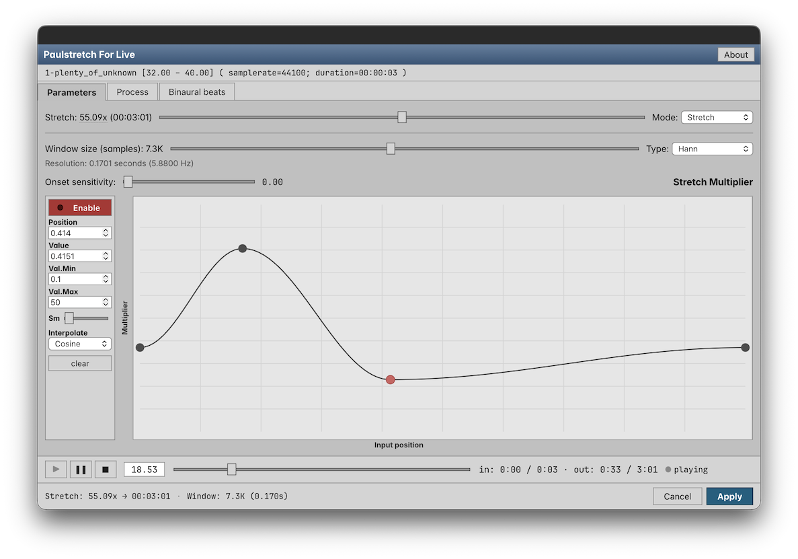

# Paulstretch For Live — Ableton Live extension

*This is an experimental program for extreme stretching the audio.*



Embeds [libpaulstretch](https://github.com/olilarkin/libpaulstretch) — a modern
C++ rewrite of [paulstretch](https://hypermammut.sourceforge.net/paulstretch/) —
as an Ableton Live extension.

See also [Paulstretch For Web](https://github.com/olilarkin/paulstretch-for-web)

## Just want to use it?

Extensions are a new feature in Ableton Live 12.4.5 (Suite), currently in beta.
They won't work in previous versions. 

Grab the prebuilt `Paulstretch-<version>.ablx` from this repo's
[Releases](../../releases) and install it into Live (Preferences →
Extensions). You don't need any of the build steps below.

## Building from source

This extension depends on the **Ableton Extensions SDK**
(`@ableton-extensions/sdk` and `@ableton-extensions/cli`), which is **not yet
published to npm**. `package.json` references both as local tarballs under
`vendor/`:

```jsonc
"@ableton-extensions/sdk": "file:./vendor/ableton-extensions-sdk-<version>.tgz"  // dependency
"@ableton-extensions/cli": "file:./vendor/ableton-extensions-cli-<version>.tgz"  // devDependency
```

So before `npm install` will work you have to drop those two tarballs into
`vendor/` yourself.

### 1. Get the SDK and CLI in place

Download the Extensions SDK zip (e.g. `extensions-sdk-<version>.zip`) from the
[Extensions SDK site](https://ableton.github.io/extensions-sdk) and unzip it.
Inside you'll find two tarballs:

```
ableton-extensions-sdk-<version>.tgz
ableton-extensions-cli-<version>.tgz
```

Copy both into a `vendor/` folder at the root of this repo:

```sh
mkdir -p vendor
cp /path/to/ableton-extensions-sdk-<version>.tgz vendor/
cp /path/to/ableton-extensions-cli-<version>.tgz vendor/
```

The filenames must match the `file:./vendor/…` paths in `package.json` exactly
(they carry the version).

### 2. Install dependencies

```sh
npm run install:all   # installs the host, then src/dialog
```

### 3. Build and package

```sh
npm run build       # vite-build the dialog + esbuild the host
npm run package     # produce Paulstretch-<version>.ablx
```

### 4. Run

```sh
npm start
```

opens Ableton Live against the local build (Live must have Developer Mode
enabled in Preferences → Extensions).

## Dev tips

- `npm run dev:ui` — run the dialog standalone in Vite for UI iteration.
  In standalone mode the file menu / drag-drop are active; the Apply bar
  is hidden.
- The dialog detects "host mode" by checking whether `window.__INITIAL_DATA__`
  contains real values (vs the placeholder text from `index.html`).
- The .ablx packager includes the entire Vite-built `dist/dialog/` tree as
  runtime assets (see `package.js`'s `ABLX_INCLUDES`).

## License

Paulstretch For Live is licensed under the GPL v2.0

The bundled dialog ships two fonts, each under the
[SIL Open Font License 1.1](https://openfontlicense.org). Their license texts
are included both in this repo and inside every `.ablx`, under
`src/dialog/public/licenses/` → `dist/dialog/licenses/`:

- **Inter** — © The Inter Project Authors — `Inter-LICENSE.txt`
- **JetBrains Mono** — © The JetBrains Mono Project Authors — `JetBrainsMono-LICENSE.txt`

[libpaulstretch](https://github.com/olilarkin/libpaulstretch) is also GPL v2.0

## Credits

Paulstretch For Live. Copyright [Oliver Larkin](https://olilarkin.com) 2026.

Based on [Paulstretch](https://hypermammut.sourceforge.net/paulstretch/) by
[Nasca Octavian Paul](https://www.paulnasca.com/).
